## Team Pakchoi 🥬

- [cpak](https://github.com/PCHANUL)
- [sarchoi](https://github.com/srngch)

[](https://42seoul.kr/)
[![result](https://img.shields.io/badge/Success-100/100-5cb85c?style=flat-square&logoWidth=12&logo=data:image/png;base64,iVBORw0KGgoAAAANSUhEUgAAADAAAAAwCAYAAABXAvmHAAAAAXNSR0IArs4c6QAAAylJREFUaEPtmDmLVEEUhb+LK+IG7qIibuCKYCYYOSoGomjimoggOgiKmYGhgYEMGqgYiJmIG4ig4IKGitsv8Ae4m7ocuWO108u8flWvu+030JXN9Kmqc+49devWM0b4sBHOn56Abmewl4FeBnIiIGk6cBtYCxwzs2vVU0ptIUkzgEfAmkBawFEzu1QRUVoBgfxjYHVdklzEETO77P8vpYAm5CtafgMH3U6lEyBpJuCRX5VzPH4BB0olIJB/AqyMrG4fSiNA0izAya+IJO+wp6UQkGCbam3vgL6uCyhgGxfxl7zZx64KCLbxAxvr+RryXS2jBT3/L/JdvcjaRX7YDEhaBJwB3gOnzexHQlXIhUqa69UDWJYLHgK8DZ7/VD+n5gxIWgfcB7yk+bgF7DaznwmbZUIlzQ6XVEqpbLDNsM2cpI2h65tcx+AmsKdVEYG81/nlCcHwyG/yapM1ZzADkvYBV4ExGcAbwF4z8+s7eUiaF2yzJGFypm1qMiCpH7gQ0di5wENm5o1U9ChI/k3w/Oe8jUzSd2BSHjD8fgU4bGbe0uYOSfND5BfngocA0eR9igu4C2xP2OAi0J8nQtKC0NukkH8dPJ8b+QpfFzABeABsSBBxHjieJaJg5KM8X8+xcoinhPLmZTR2DJjZiXpwwcgXIj9ooQqB8Hh+ltjOnjOzk1VruG38kvLLMHYUJl8jwP8It+RzIMW3Z4FTYc5DYGEsc+BV8PyXhDk10IZuVJITcBFeQWLH11DJRsVOaAf5hgxUWWEp4Haak0AoBeql0m/Yht4mZZFMAcFO/jnD/TwtddEcfFKdz9u76YNGkn8NcxFT8xaK/L2t5JtmoMpO6wE/nBMjSWbB2k4+SkCwUx9wDxhfUETyDRu7T/SbWNI2wFvrsbGLB9xLYLOZeaVq+4gWEDKxFbgDjItk0rHIV/ZPEhBE7AD8fZD1dqis/QLY0qnIFxYQROwErjcR0fHItyQgR8R/Ix9dhbL8LmlXyMTogPHexg9sdD8feZYyYclnoH4lSW6ngfC5b7+ZfWuVVMr8lgWkbNYJbE9AJ6KasmYvAynR6gR2xGfgD5kpEElZbxKNAAAAAElFTkSuQmCC)](https://projects.intra.42.fr/42cursus-minishell/sarchoi)


[](https://github.com/42pakchoi/minishell)
[](https://github.com/42pakchoi/minishell)


Illustration by [sarchoi](https://github.com/srngch)

<details>
  <summary>Table of Contents</summary>
  <ol>
    <li><a href="#requirements">Requirements</a></li>
    <li><a href="#implementation">Implementation</a></li>
    <li><a href="#project-structure">Project Structure</a></li>
    <li><a href="#environment">Environment</a></li>
    <li><a href="#compile">Compile</a></li>
		<li><a href="#execute">Execute</a></li>
		<li><a href="#example">Example</a></li>
		<li><a href="#test">Test</a></li>
		<li><a href="#logics">Logics</a></li>
		<li><a href="#links">Links</a></li>
  </ol>
</details>

---

# Minishell

The objective of this project is for you to create a simple shell. Yes, your own little bash or zsh. You will learn a lot about processes and file descriptors.

## Requirements

|                      |                                           |
| -------------------- | ----------------------------------------- |
| **Program name**     | `minishell`                               |
| **Makefile**         | `all`, `clean`, `fclean`, `re`            |
| **Arguments**        | None                 |
| **External functs.** | `readline`, `rl_on_new_line`, `rl_replace_line`, `rl_redisplay`, `add_history`, `printf`, `malloc`, `free`, `write`, `open`, `read`, `close`, `fork`, `wait`, `waitpid`, `wait3`, `wait4`, `signal`, `kill`, `exit`, `getcwd`, `chdir`, `stat`, `lstat`, `fstat`, `unlink`, `execve`, `dup`, `dup2`, `pipe`, `opendir`, `readdir`, `closedir`, `strerror`, `errno`, `isatty`, `ttyname`, `ttyslot`, `ioctl`, `getenv`, `tcsetattr`, `tcgetattr`, `tgetent`, `tgetflag`, `tgetnum`, `tgetstr`, `tgoto`, `tputs` |
| **Libft authorized** | Yes                                       |

## Implementation

- prompt
- history
- builtins
	- `echo` with option `-n`
	- `cd` with only a relative or absolute path
	- `pwd` without options
	- `export` without options
	- `unset` without options
	- `env` without options or arguments
	- `exit` without options
- interpretation `"` only for `$`
- redirections
	- `<` redirect input
	- `>` redirect output
	- `<<` heredoc
	- `>>` redirect output with append mode
- pipes: `|`
- environment variables: `$`
- exit status: `$?`
- signal interactive like bash
	- `ctrl-c` print a new prompt on a newline.
	- `ctrl-d` exit the shell.
	- `ctrl-\` do nothing.

## Project Structure

```
./
├── includes/		# header files
├── libft/		# library files
├── src/		# source files
│   ├── builtin/	# builtin commands
│   └── util/		# utility functions
├── test/		# test command files
└── Makefile
```

## Environment

- MacOS 12.3.1(Monterey, Intel)

Developed and tested in this environment.

## Compile

Install the following dependencies:

```bash
$ brew install readline
$ brew info readline
# export LDFLAGS="-L/usr/local/opt/readline/lib"
# export CPPFLAGS="-I/usr/local/opt/readline/include"
```

Check flag `LDFLAGS` and `CPPFLAGS` in `Makefile` is same as on `brew info readline`.

If you want to run Minishell at 42 Cluster Mac, you need to change the following:

```Makefile
READLINE_FLAGS = -l readline -L ${HOME}/.brew/opt/readline/lib

INC_FLAGS = -I includes -I $(LIBFT) -I ${HOME}/.brew/opt/readline/include
```
### Mandatory

```bash
$ git clone https://github.com/42pakchoi/minishell
$ make
```

## Execute

Run compiled executable file in the root folder.

```bash
$ ./minishell
~/path_to_pwd/minishell $ 
```

## Example

```bash
# minishell builtin commands
~/path_to_pwd/minishell $ echo "Hello world!"
Hello world!
# commands in PATH
~/path_to_pwd/minishell $ ls
Makefile	includes	minishell	test
README.md	libft		src
# command `exit` or press `ctrl-d` to exit the minishell
~/path_to_pwd/minishell $ exit
```

## Test

### Test command

Test using files with multiple lines of command in `test` directory. Each line of the file is in the following format: `command >> result.txt`

```bash
$ bash -i < test.txt # run interactive mode bash with test file
$ mv result.txt result_bash.txt # change file name to keep result of bash
$ ./minishell < test.txt # run minishell with test file
$ diff result.txt result_bash.txt # compare result of bash and minishell
$ cat result.txt # show result if you want
```

### Check memory leak

```bash
$ leaks -atExit -- ./minishell
```

Runs leaks when the Minishell exits.

### Check priority of `$PATH`
```bash
$ cp /bin/cat /tmp/ls # copy cat to /tmp/ls

$ ./minishell
~/path_to_pwd/minishell $ unset PATH
~/path_to_pwd/minishell $ export PATH=/tmp:/bin
~/path_to_pwd/minishell $ ls # should be /tmp/ls (it is cat actually) and not /bin/ls
```

## Logics

### Flow Chart

#### Entire

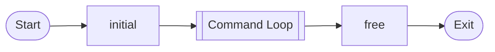

#### Command Loop


#### `deal_command()`
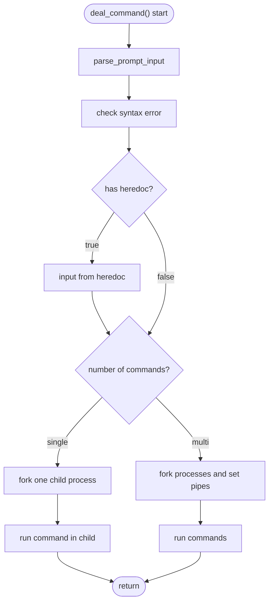

### Steps to parse input

1. String `char *g_mini.prompt_input` is allocated from `readline`
	```c
	"echo hello $USER | cat -e > out.txt" // g_mini.prompt_input
	```
2. `g_mini.prompt_input` is split by a operator(`>`, `>>`, `<`, `<<`, `|`), into string array `char **arr`
	```c
	"echo hello $USER" // arr[0]
	"cat -e" // arr[1]
	"out.txt" // arr[2]
	```
3. Elements of `arr` is split by white space into a string array `char **strarr`
	```c
	"echo" // strarr[0] 
	"hello" // strarr[1] 
	"$USER" // strarr[2] 
	```
4. Translate environment variables name to value if `$` is found in the element of `strarr`
	```c
	"echo" // strarr[0] 
	"hello" // strarr[1] 
	"pakchoi" // strarr[2] 
	```
5. Keep `strarr` and a operator data in `t_cmd` structure and add it to the list `t_cmd *g_mini.cmd`

### Priority of command execution

1. `exec_assign()`: If string is input in the form `name=[value]`, assign it as a environment variable
2. `exec_builtin()`: If the command is builtin command of minishell, then run it
3. `exec_execve()`: If the command is not builtin command, then run it with `execve()`

### File Descriptor and pipe


#### Setting child process to execute commands

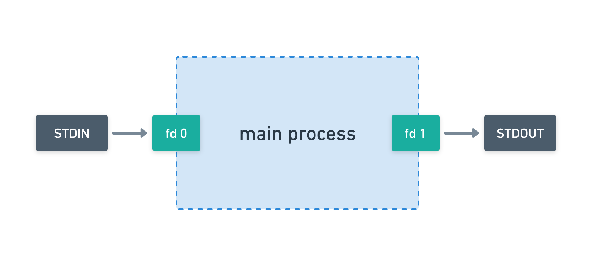

#
## loop 1

Create a child process and pipe to execute the first command. The input of the pipe is connected to the child process, and the output is connected to the main process for the subsequent child process.

<details>
<summary>loop 1 details</summary>

### loop 1-1 : pipe  
Create a pipe from the main process before creating the child process.
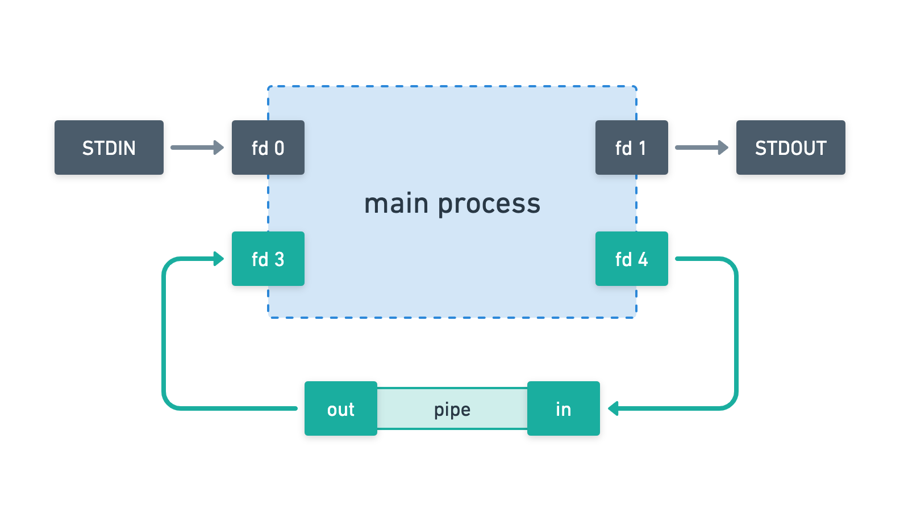

### loop 1-2 : fork
The child process to execute the command is forked. The forked child process has the same fd because it duplicated the main process.

### loop 1-3 : close & dup
In the child process, replicate the pipe input fd to the STDOUT fd and connect it. And close the fd that you will not use.
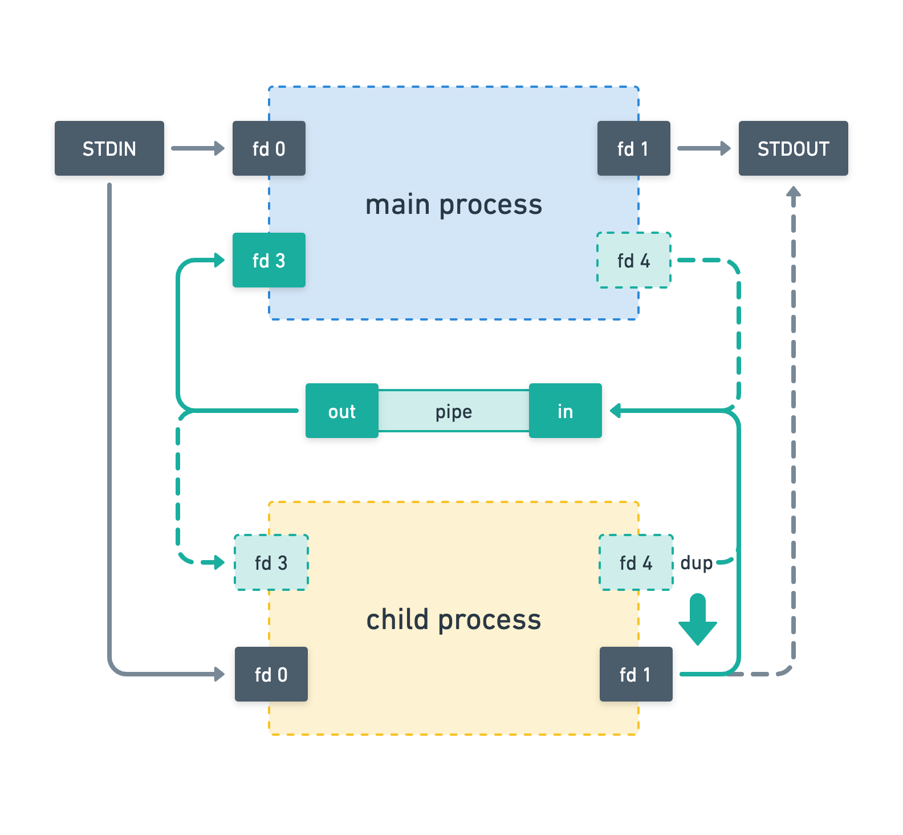
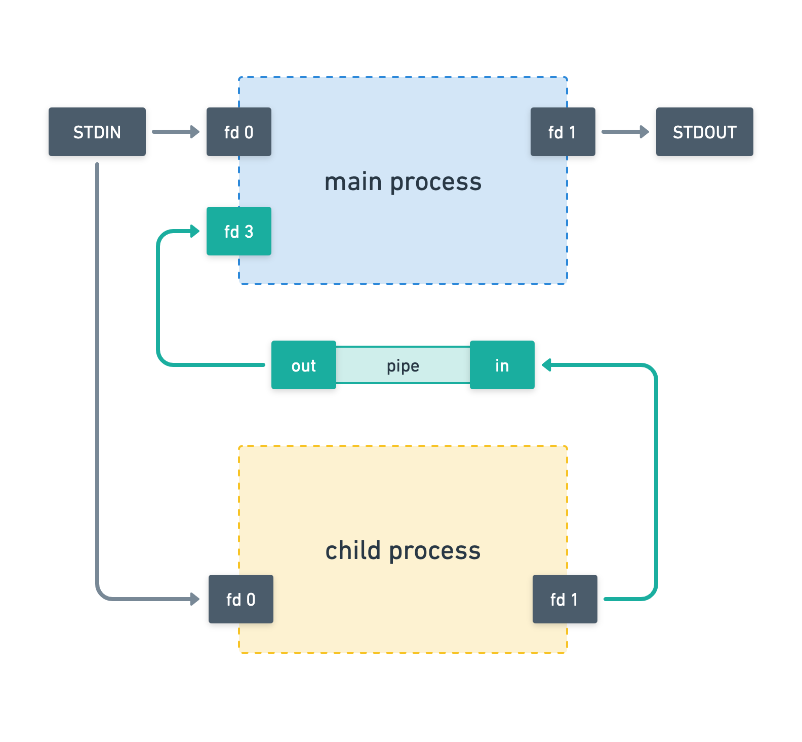

</details>

##
##


#
## loop 2

Create a child process and pipe as before. The difference, however, is that it connects to previously generated pipes to the process generated.

<details>
<summary>loop 2 details</summary>

### loop 2-1 : pipe & fork
Create pipes and child processes as before. The difference is that I have one more fd. This fd is the pipe fd of previously generated child processes.
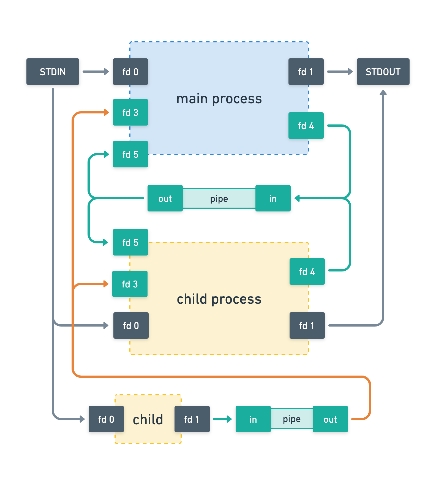
### loop 2-2 : close & dup
Replicate the pipe fd to the STDIN and STDOUT of the child process. To STDIN, connect the out fd of the previously generated pipe, and to STDOUT, connect the in fd of the pipe generated this time. And close the fd that you will not use.
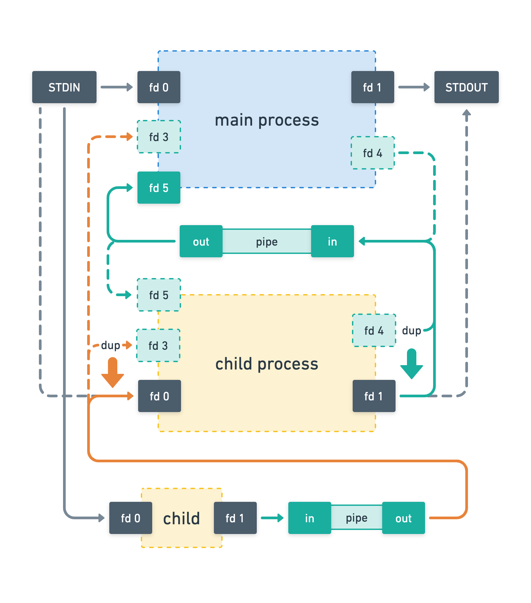
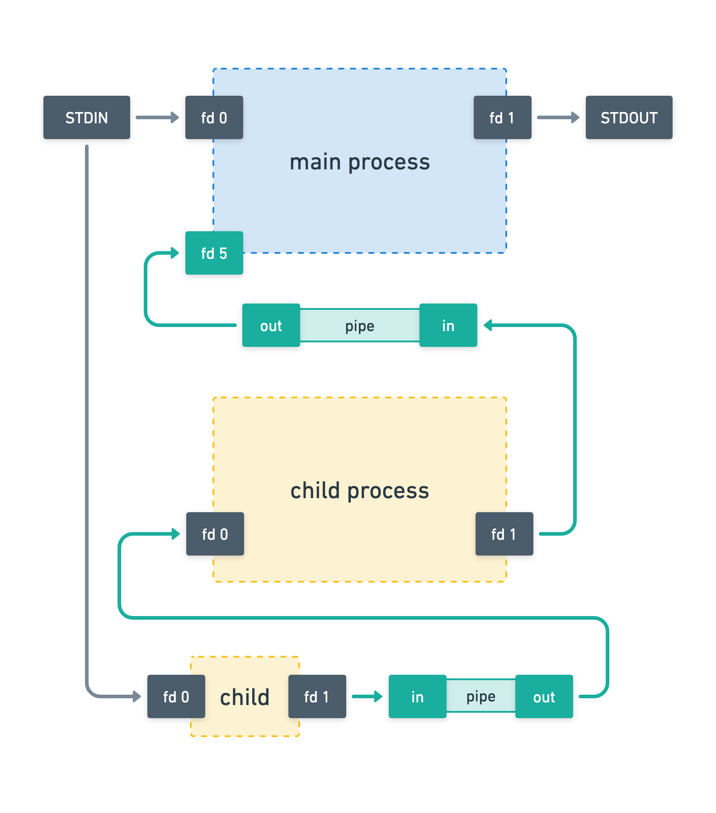

</details>

##
##

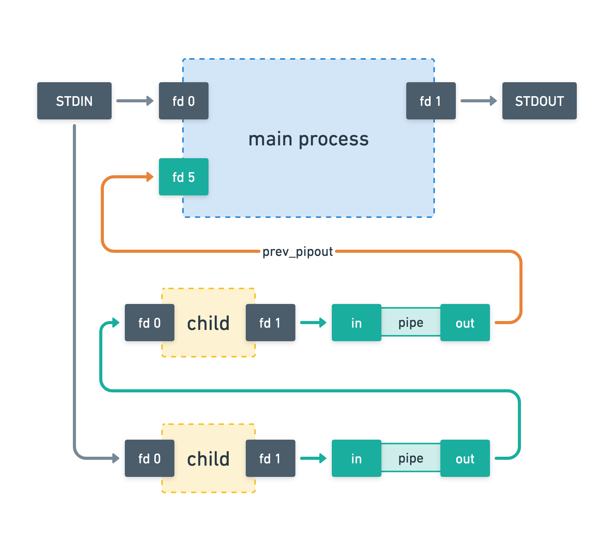

#

## loop 3

In the last loop, you don't connect the child process to the pipe. The command of the last child process is printed on the screen.

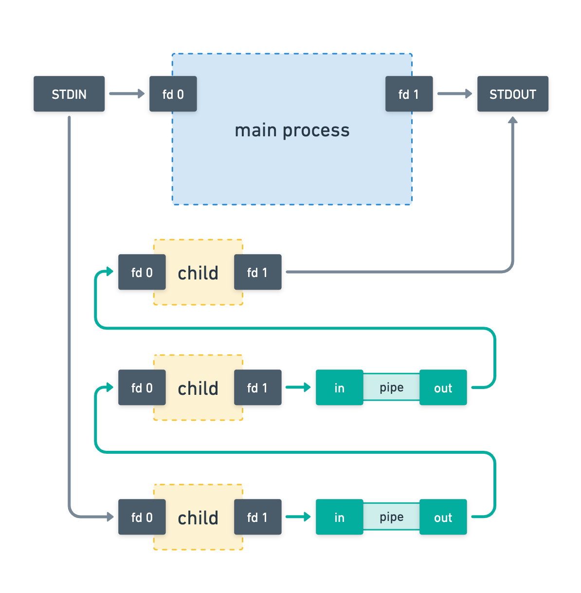

## Links

- [Subject - 42 Intra](https://projects.intra.42.fr/projects/42cursus-minishell)
- [Subject - 42Seoul Translation](https://github.com/42seoul-translation/subject_ko/blob/master/minishell/minishell.md)
- [GNU Bash manual](https://www.gnu.org/savannah-checkouts/gnu/bash/manual/)
